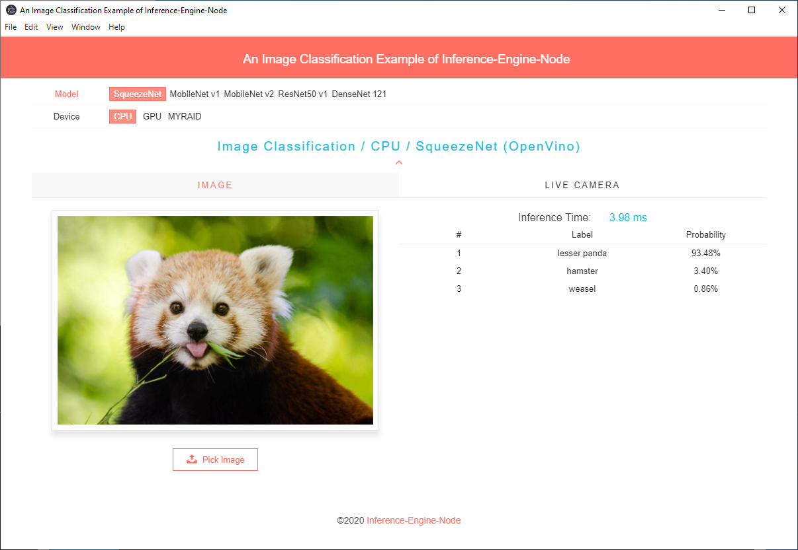

# A Node.js example of image classification using inference-engine-node

### Install

```
$ npm install
```

### Download Models

Please follow the instructions of [webml-polyfill/examples/image_classification/model/README.md](https://github.com/intel/webml-polyfill/blob/master/examples/image_classification/model/README.md) to download the OpenVINO models (.xml and .bin), and put them into path `<inference-engine-node>/example/hello_classification_electron/model`:

The following five models are verified. 

* SqueezeNet (squeezenet1.1.{bin,xml})
* MobileNet v1 (mobilenet_v1_1.0_224.{bin,xml})
* MobileNet v2 (mobilenet_v2_1.0_224.{bin,xml})
* ResNet 50 (resnet-50.{bin,xml})
* DenseNet 121 (densenet-121.{bin,xml})

### Run

```bash
npm run start
```

### Screenshot


### Use Online Models

If users want to use the online OpenVINO models with URLs, please put URLs that can download model (.{bin,xml}) into the variables `onlineFile` (.xml) and `onlineBinFile` (.bin) of the corresponding model in `base.js`.